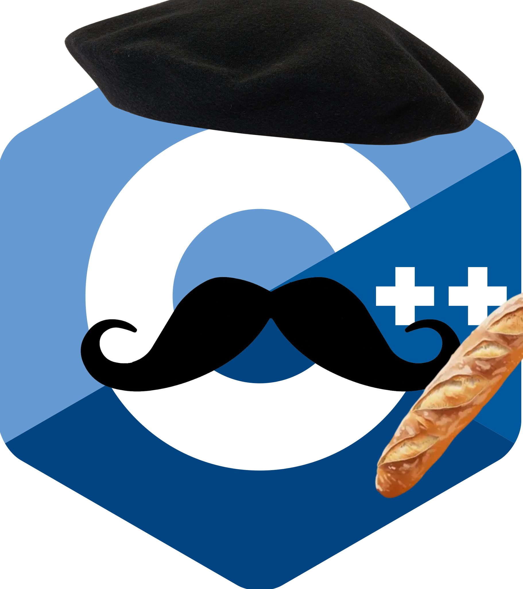

# CÉ PLUS PLUS



WELCOME TO **CÉ PLUS PLUS**, this is ze new way to programming with C++ in FRANCAIS.

## Installation
**1. Clone the repo**
```bash
git clone https://github.com/J0bot/ceplusplus.git
```

**2. Put the file ceplusplus.hpp in your project**
```bash
cd ceplusplus
mv ceplusplus.hpp folder_path
```

**3. Add `ceplusplus.hpp` to you project**
```cpp
#include "ceplusplus.hpp"
```

## Usage

### Example of code
```cpp
#include "ceplusplus.hpp"

entier debut() {
    chaine message = "Bienvenue dans CÉ PLUS PLUS";
    affiche << message << fin_de_ligne;

    liste<entier> nombres = {un , trois, quatre};
    fout_dedans(nombres, neuf);

    pour (entier i = zero; i inferieur nombres.taille(); i++) {
        affiche << "Valeur : " << nombres[i] << fin_de_ligne;
    }

    retourne zero;
}
```

### Compilation
```bash
g++ main.cpp -o programme
./programme
```

---

## Why ?
Why not.


### Inspiration : 

[Rouille](https://github.com/bnjbvr/rouille)